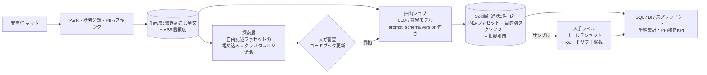

# 検討メモ: LLMによる「非構造→構造化→単純集計」アプローチの実現可能性

- 作成日: 2026-09-13
- ステータス: 初版(要件ヒアリング前の机上検討)
- 対象: コールセンター対話(音声書き起こし/チャットログ)の分析・テキストマイニング基盤

---

## 0. 結論(先に要点)

**「LLMで各通話を固定スキーマの構造化データに変換し、あとは単純集計で大半の分析目的を満たす」というアプローチは実現可能であり、2024〜2026年の研究・商用製品の双方がこの方向に収斂している。** ただし、成立条件が3つある。

1. **「汎用の分析器」ではなく「汎用の基盤データ」を作る。** 1つの万能スキーマですべての分析目的を満たそうとすると失敗する。研究(GoalEx, 意図条件付きスキーマ生成)は「同じコーパスでも分析目的が違えば正しい分類体系は違う」ことを示している。うまくいくのは、(a) 目的によらず安定して定義できる少数の基盤ファセット(用件の1文要約、解決状況、感情、フラグ類)を全通話から一度だけ抽出し、(b) その上に目的別の薄い分類体系(タクソノミー)を、再実行可能な別パスとして載せる二層構造である。Anthropic の Clio、Microsoft の TnT-LLM、Cisco のコンタクトセンター研究がこの設計で、商用製品(Google CX Insights, AmiVoice の多段階推論, Observe.AI の L1/L2/L3 用件分類)も同じ形になっている。
2. **集計値をそのまま報告しない。** LLM ラベルの精度が 80〜90% あっても、誤りが非ランダムなため集計値・回帰係数は系統的に偏る(Egami ら DSL, NeurIPS 2023)。数百件の人手ラベル付きサンプルを常備し、Prediction-Powered Inference(PPI)等で補正した推定値と信頼区間を出す運用が、現在のベストプラクティスである。これは追加コストではあるが、「いろんな人が好き勝手に LLM を使う」状態と比べれば圧倒的に小さく、かつ再現性・監査可能性を得られる。
3. **固定スキーマは腐る前提で、発見ループを組み込む。** 固定分類だけだと新しい問題(未知の未知)を取りこぼす。自由記述ファセットを定期的にクラスタリングし、候補カテゴリを人が審査してスキーマに昇格させる運用(Clio / TnT-LLM / Intercom Topic Curation 型)が必要。自由な LLM 質問は「探索用・サンプル対象・予算付き」に位置づけ、KPI には使わない。

「様々な分析目的に汎用で使えるものを作るのは筋が悪いのでは」という懸念への回答は、**「汎用の"回答エンジン"を作るなら筋が悪い。汎用の"通話1件=1行の構造化テーブル"を作り、その上を SQL/BI で好きに集計させるのは筋が良く、業界標準になりつつある」** である。

---

## 1. 問いの分解

ユーザの構想を、検証可能な問いに分解する。

| # | 問い | 本メモでの答え |
|---|------|---------------|
| Q1 | LLM は通話テキストから、集計に耐える品質で構造化フィールドを抽出できるか | 明確な定義の列挙型・短いスパンなら可(目安 85〜95%)。判断を要する項目(解決有無、感情、理由コード)は 70〜85%。全項目同時正解率はスキーマ幅に強く依存(§3.2) |
| Q2 | 「ほとんどの分析目的」は、固定スキーマの単純集計で達成できるか | 記述統計型の問い(件数・割合・推移・セグメント比較・上位要因)は達成可能。根本原因の深掘り、未知トピックの発見、個別事例の精読は別レイヤが必要(§2, §4) |
| Q3 | 汎用スキーマ 1 つでよいか、目的別スキーマが要るか | 二層構造。基盤ファセットは汎用、タクソノミーは目的別・バージョン管理(§3.1, §5) |
| Q4 | 自由に LLM に聞かせる方式と比べて何が良く、何が悪いか | 再現性・定義統一・コスト・監査で優位。新規発見・一回限りの問いでは劣位(§4) |
| Q5 | 日本語・ASR 由来のノイズ・PII などの実務要因は致命的か | 致命的ではないが、評価は必ず実データ(ASR 後・マスキング後)で行う必要がある(§3.6, §6) |

---

## 2. コールセンター分析で実際に問われることと、固定スキーマでの到達範囲

アナリストレポート(Forrester Wave: Conversation Intelligence for Contact Centers Q2 2025、Gartner の GenAI コンタクトセンター用途優先度 2025、McKinsey のコンタクト分析記事)と商用製品の機能から、繰り返し問われる分析目的を整理し、固定スキーマ+単純集計でどこまで届くかを見積もる。

| 分析目的 | 典型的な問い | 固定スキーマで必要な列 | 単純集計での到達度 |
|---|---|---|---|
| 入電要因分析(Call Driver) | 何の用件が多いか、増えているか | 用件 L1/L2、用件1文要約 | ◎ 件数・推移・構成比 |
| 再入電・未解決要因 | どの用件が解決されず再入電を生むか | 解決状況、再入電示唆、顧客IDでの結合 | ◎(CRM 結合が前提) |
| 解約・離反シグナル | 解約意向を示した通話の割合と要因 | 離反示唆フラグ+理由、根拠引用 | ○ フラグ精度に依存 |
| 応対品質(QA) | 名乗り・本人確認・復唱・共感の実施率 | 応対チェック項目(bool 群) | ◎ 商用製品の主戦場 |
| コンプライアンス・カスハラ | 禁止表現、脅迫的発言の検知 | フラグ+根拠引用 | ○ 再現率重視で人手確認へ回す設計 |
| VOC・商品フィードバック | 商品 X への不満は何か | 対象商品、要望種別、自由記述 | △ 集計は可能だが「何が」の部分は自由記述の再クラスタリングが要る |
| 感情トレンド | 通話終了時の感情はどう推移したか | 感情(開始/終了) | ○ 定義次第。人手一致率も低めの項目 |
| オペレータ別分析 | 誰の解決率が低いか、何が原因か | 上記 + オペレータID | ◎ 集計は容易。原因はサンプル精読 |
| 未知の問題の早期発見 | 先週から急に増えた新しい訴えは | (固定列では不可) | × 探索層(クラスタリング)が必要 |
| 根本原因分析 | なぜ再入電が増えたのか | (集計は仮説の絞り込みまで) | △ 集計で当たりを付け、対象通話を LLM/人が精読 |

見積もりとしては、**問いの「件数」ベースで 7〜8 割は固定スキーマの集計で完結し、残りは「集計で絞り込んで対象通話を読む」か「探索層」で対応する**、という姿になる。実務家の整理(Rippit の会話タクソノミー手引き、Emotion Tech の 2025 年コラム「観点を事前に指示して抽出しダッシュボード化」)もこの形である。

---

## 3. 技術・研究動向

> 出典に関する注記: 調査時、arXiv・ACL Anthology・多くのベンダーサイトへの直接アクセスが制限され、一部の数値は検索結果の要約に基づく。外部に引用する際は原典で再確認すること(該当箇所に「要確認」と付す)。

### 3.1 LLM によるタクソノミー(分類体系)の誘導と大規模ラベリング

| 研究 | 概要 | 本件への示唆 |
|---|---|---|
| **TnT-LLM**(Microsoft, KDD 2024) | Bing Copilot ログに対し、LLM がミニバッチ反復で分類体系を生成→LLM がサンプルをラベル→埋め込み+ロジスティック回帰等の軽量分類器に蒸留。蒸留モデルは GPT-4 自身とほぼ同精度(0.658 vs 0.655、人手評価 400 件、要確認) | 「LLM が体系を作り、安価なモデルで全量適用」は成立する。ただし対人手の絶対精度は約 65% で、オープンな会話の意図分類は本質的に曖昧 |
| **TopicGPT**(NAACL 2024) | LLM がトピックを生成→統合・剪定→各文書へ根拠引用付きで割り当て。純度 0.74 vs ベースライン 0.64。同一設定でも実行間に ±0.05 程度の揺れ | 根拠引用付きの割り当ては集計と監査に向く。実行間の揺れは前提として設計する |
| **LLooM**(Stanford, CHI 2024) | 概念ごとに「明示的な包含基準」を LLM に書かせ、それを全文書に適用してスコア化。カバレッジ 93% vs BERTopic 77.7% | 「基準文がそのままスキーマ定義になる」設計は監査可能性が高く、コードブック運用と相性が良い |
| **GoalEx**(EMNLP 2023) | 「〜の観点でクラスタせよ」という目的文を与えた説明可能クラスタリング | **同じコーパスでも目的が変われば正しい分割は変わる**。汎用タクソノミー 1 つでは無理、という直接の証拠 |
| **Clio**(Anthropic, 2024-12) | 各会話から少数の固定ファセット(要約・言語・ターン数等)を抽出→埋め込み→k-means→LLM が命名→階層化。100 万会話。合成した既知トピック構成を 94% の精度で復元 | 「少数の汎用ファセット+ボトムアップ分類」で 2 年分の Economic Index 分析が回っている実例。O*NET のような外部のトップダウン体系も併用可能 |
| Dial-In LLM(EMNLP 2025) | 中国語カスタマーサービス通話 10 万件超で LLM-in-the-loop 意図クラスタリング。命名の人手一致 95% 超、下流分類 +12% | コールセンター実データでも成立 |
| Cisco「LLM-Based Insight Extraction for Contact Center Analytics」(2025-03, arXiv 2503.19090) | 各通話から自由記述の「call driver」を生成し、それを基盤にトピックモデリング・分類・トレンド検知・FAQ 生成を派生。ファインチューンした小型モデルで商用 API に迫るコスト効率 | **自由記述 1 文の用件要約を基盤成果物にする**という設計判断の裏付け |
| 銀行の意図発見研究(2025, arXiv 2505.11176) | 人手 36 意図を 278 意図に拡張、分類器 92% | 用途(FAQ ボット)が求める粒度は分析用途と異なる。粒度は目的依存 |
| CallCenterEN(2025-07, arXiv 2507.02958) | 英語 BPO 通話 91,706 件・10,448 時間の公開コーパス(CC BY-NC) | 手法検証用のテストベッドとして利用可(英語) |

**質的研究(コーディング)への LLM 適用の信頼性:** LATA(CSCW 2025)で GPT-4 と人の κ=0.72、LOGOS(2025)で専門家スキーマとの整合 80% 前後。一方、帰納的に LLM が作ったコードが人手コードと一致したのは 31% という報告(JMIR 2026)、民族誌的テキストでは実用に耐えないという報告(2026)もある。**人間同士の一致率が低い項目は LLM でも低い**(人手一致が天井)というのが一貫した知見。

### 3.2 構造化抽出の信頼性

- **形式妥当性は解決済み、値の正しさは未解決。** OpenAI Structured Outputs(2024-08)、Anthropic の structured outputs(2025-11 ベータ→GA)、vLLM/XGrammar 等の制約付きデコードにより、平坦なスキーマなら JSON 準拠率はほぼ 100%。JSONSchemaBench(2025-01)は複雑・再帰的スキーマでは準拠率が崩壊すること(Outlines 3% 等)を示す。→ **通話スキーマは平坦・列挙型中心・再帰なし**にする。
- **制約付き出力は推論を阻害しうるが、分類・抽出では有利。** 「Let Me Speak Freely?」(2024-08)は JSON モードで推論タスクが大幅劣化するが分類は改善すると報告。dottxt の反論(2024-11)と ICML 2026 の draft-conditioned decoding 研究は、**推論用の自由記述フィールドを回答フィールドの前に置く**ことでほぼ回復すると示す。→ 判断項目(解決有無など)には `reasoning`/`evidence` を先に書かせる。
- **対話状態追跡(DST)の到達点。** MultiWOZ のゼロショット Joint Goal Accuracy は 2026 年でも 50% 台(ReacTOD, 要確認)、SGD で 80% 程度。スロット単位の精度はずっと高い。→ **「1 通話の全項目が同時に正解」は 5〜10 項目で 50〜80%** と見込む。項目単位で評価・利用する。
- **スキーマ幅が最大の敵。** ExtractBench(2026-02)では数百項目の広いスキーマに対しフロンティアモデルでも文書単位合格率 5〜7%。→ 広いスキーマは複数の焦点化した呼び出しに分割する(DocETL の分解指針と一致)。
- **検証パス。** Infinitus の Auto Review(ACL 2025 Industry)は医療通話で「抽出→別 LLM が項目ごとに検証/再抽出→不一致は人へ」を本番運用。ASR の n-best も入力に使う。→ 高リスク項目(金額・ID・コンプライアンス)はこの型。
- **信頼度。** LLM に「自信を 1〜10 で」と言わせた値はほぼ無情報(AUC≈0.54)。logprob や独立検証パスを使う。
- **現実的な精度感(総合):** 列挙型・短スパン 85〜95%、判断項目 70〜85%、数値・氏名・ID は ASR 依存で別途対策。

### 3.3 LLM をデータ処理演算子として扱う系(DB コミュニティ)と DWH 内 LLM 関数

- **LOTUS**(VLDB 2025)は `sem_map / sem_filter / sem_agg / sem_join` 等の意味演算子を提供し、安価なプロキシモデルへのカスケードで最大 1,000 倍高速化。ただし精度保証は「高価なモデルの出力に対する相対保証」であり、人手正解との差は別途扱う。**BARGAIN**(SIGMOD 2026)は保証付きの安価モデル振り分けでコスト最大 86% 削減。**DocETL**(VLDB 2025)は広い抽出の分解と検証再試行(gleaning)で 21〜80% 精度向上。
- **DWH 各社が「スキーマ宣言→行ごと抽出→GROUP BY」を SQL の一級市民にした。** Snowflake Cortex AISQL(AI_CLASSIFY / AI_EXTRACT(2025-08 プレビュー)/ AI_AGG)、BigQuery AI.GENERATE_TABLE(2025-05、出力スキーマを DDL 風に宣言)、Databricks ai_extract / ai_query(response_format で JSON スキーマ)、DuckDB の flock 拡張(VLDB 2025 デモ)。→ 本構想はプラットフォーム側の設計思想とも整合しており、自前実装の範囲を小さくできる。
- **集計クエリと RAG。** 「先月 X に関する通話は何件か」は top-k 検索では原理的に答えられない。Structured RAG for Aggregative Questions(2025-11)、Global RAG(2025-10)はいずれも**まず属性を表に抽出してから集計**する。UDA-Bench(2025-10)は長文書に対して「質問のたびに全文を読む」方式が最も高コストであることを示す。→ 通話(長文・同じ問いの反復)は「一度抽出して集計」が構造的に有利。

### 3.4 ノイズ付きラベルから妥当な集計値を得る統計手法

本構想の成否に最も効く部分。

- **Prediction-Powered Inference(PPI)**(Science 2023、PPI++ 2023、`ppi_py`): 全件の LLM ラベル+少数の人手ラベルから、平均・分位点・回帰係数の妥当な信頼区間を得る。予測器に仮定を置かない。
- **Design-based Supervised Learning(DSL)**(Egami ら, NeurIPS 2023、R パッケージ `dsl`): LLM ラベルを直接使うと、精度 80〜90% でも推定が偏り信頼区間が無効になることを示し、二重頑健推定量で回復。
- **Confidence-Driven Inference**(NAACL 2025): LLM の信頼度で人手ラベル対象を選び、人手コストを 25% 以上削減しつつ保証を維持。
- **LLM Hacking**(2025-09, arXiv 2509.08825): 37 タスク・1,300 万ラベルの再分析で、最先端モデルでも約 3 分の 1 の結論が誤り。人手ラベル+PPI/DSL 型補正が最も有効な緩和策。
- **Variance-Aware LLM Annotation**(2026-01): プロンプト文言やモデル選択で結果が 12〜85 ポイント動く。誤りが共変量と相関すると平均精度が高くても推定が偏る。

→ **運用上の含意:** 期間ごとに無作為抽出した数百件を人がラベルし、KPI は PPI 補正値+信頼区間で報告する。閾値付近の判断(「10% を超えたら施策発動」等)は特に注意。

### 3.5 小型モデルへの蒸留

- ModernBERT-base への蒸留で教師 F1 の 97% 以上を維持しつつ約 45 倍のスループット(2025-12, 要確認)。TnT-LLM も同じ結論。Pangakis & Wolken(2024)はラベリングコスト 50〜96% 削減。
- **リスク:** LLM ラベルで学習した小型分類器は少数クラスで系統的に崩れる(「Feeding LLM Annotations to BERT Classifiers at Your Own Risk」2025-04)。長尾カテゴリは蒸留せず LLM のまま、または人手ラベルを補う。
- **日本語:** SB Intuitions の ModernBERT-Ja(30M〜310M、8k コンテキスト、2025-02)、LLM-jp の llm-jp-modernbert が利用可。1 通話全体を 1 入力にできる 8k コンテキストは重要。
- **蒸留が割に合う条件:** 定義が安定した項目、月数万通話以上、数千件の検証セットを用意できる場合。毎月定義が変わる項目・自由記述出力には不向き。

### 3.6 日本語・ASR・PII に関する知見

- **日本語ベンチマーク:** Nejumi Leaderboard 4(2025-12)ではフロンティアモデルが 0.81〜0.83 に密集しており、モデル選択より**プロンプト/スキーマ設計と人手校正が効く**局面。JGLUE、llm-jp-eval、JMTEB(クラスタリング・分類データ含む)が利用可。**公開された日本語コールセンター通話ベンチマークは見当たらない**ため、自社データでの評価セット構築が必須。
- **ASR 誤り:** 数字・固有名詞・ID・無音時の幻覚が典型的失敗(Call2Instruct 2026-01 等)。下流精度の劣化は ASR の情報損失に比例し、LLM の強さでは補えない(2026 研究、要確認)。→ 評価は必ず ASR 後の実テキストで行い、数値系項目は読み上げ確認や n-best を使う。
- **PII:** LLM 手前でのゲートウェイ型マスキング(Presidio、ASR ベンダー機能)が標準。**マスキングが抽出対象(金額・日付)を消すことがある**ので、マスキング後データで精度を測る。
- **プライバシー面の注意:** Clio 型のクラスタ出力からも診断名等が 39% 復元できたとする攻撃研究(Cliopatra, 2026、要確認)があり、「要約・クラスタ名だから安全」とは限らない。

### 3.7 商用製品・国内市場の設計から読み取れること

**方向性は一貫している。**

1. **全ベンダーが「通話 1 件=1 行」を永続化し、ダッシュボードまたは顧客の DWH で集計する。** Amazon Connect Contact Lens(要約・感情・カテゴリ→S3/Athena)、Google CX Insights(カスタム要約セクション=ユーザ定義フィールド、BigQuery エクスポート)、Salesforce Generative ECI(Spring '26、管理者定義の生成インサイト最大 8 個を CRM 項目として保存)、NICE AutoSummary(意図・行動・結果・感情)。
2. **スキーマの出所は 3 系統が共存する。** ベンダー固定(感情・沈黙・トーク比率)、**自然言語で定義するユーザ定義項目**(Contact Lens の生成 AI カテゴリ、Observe.AI の Gen AI Moments、Gong の Smart Trackers、Balto の自然言語基準)、**LLM が発見する体系**(Contact Lens テーマ検知、Google のトピック発見→推論用体系として凍結、Sprinklr の生成テーマ)。
3. **固定分類の老舗が「何でも聞ける」層を後付けした**(Gong Ask Anything 2024-03、Verint Genie Bot 2024、CallMiner AI Assist 2024-10、Cresta AI Analyst 2025-01、NICE Copilot for Supervisors 2024-09、RevComm MiiTel「AI に質問」2025-03)。逆に **発見結果を固定スキーマに凍結する動き**(Google のトピック推論、Salesforce の 8 項目上限)もある。Forrester Wave 2025 は「分類」「シグナル抽出」「探索」「自然言語 IF」を別々の評価軸にしており、両方が必要という認識。
4. **国内:** AmiVoice の「AI 多段階推論」(2025-11)は第 1 段で用件分類→第 2 段で用件別プロンプトにより要約・Q&A・VOC を抽出する、まさに構造化抽出の設計。PKSHA Speech Insight は用件分類+用件別要約フォーマット+CRM 保存。NTT テクノクロス ForeSight Voice Mining は tsuzumi でオンプレ要約。TMJ Conversation Monitor(2025-08)は全通話を応対方針に照らして自動評価。BPO 各社(ベルシステム24 s.i.g.n.、アルティウスリンク+ELYZA)も「LLM で観点抽出→ダッシュボード」。Microsoft Dynamics は教師なしトピッククラスタリングを 2025 年に廃止し Copilot 系へ移行。

→ **「固定スキーマ抽出+集計が記録系(system of record)、自由質問は探索層」が市場のコンセンサス。** 自前で作る場合も同じ配置にするのが安全。

---

## 4. 論点整理: 固定スキーマ+単純集計 vs. 自由な LLM 利用

### 4.1 固定スキーマ+集計を支持する根拠

- **再現性・監査可能性:** 本番の LLM 推論は temperature 0 でもビット再現しない(Thinking Machines 2025-09)。質問のたびに生テキストを LLM に読ませた数値は再現しない。一度抽出し、プロンプト/モデル/スキーマのバージョンと共に保存した値は再現し、再実行もできる。
- **定義の統一(metric drift 対策):** 誰が聞くかで数値が変わる「メトリック・ドリフト」は text-to-SQL の主要な失敗様式(Omni、dbt 2026 ベンチマーク)。企業スキーマに対する text-to-SQL は Spider 2.0 で依然 50% 前後(要確認)、意味層で定義を固定すると 90% 台後半。**小さく文書化された抽出テーブルそのものが意味層になる。**
- **コスト:** 通話ごとに 1 回払うか、質問ごとにコーパス全体分を払うか。長文で同じ問いが繰り返される通話分析では前者が桁で安い。安定項目は小型モデルに蒸留でさらに 1〜2 桁下がる。
- **ガバナンス:** 「いろんな人が好き勝手に LLM を使う」状態は、定義不一致・再現不能・コスト膨張・監査不能を同時に生む。固定スキーマは、そのままコードブック(定義書)としてチーム間合意の器になる。質的研究の知見でも、**モデル性能よりコードブックの質がラベル妥当性の第一要因**(「What is a protest anyway?」2025-10)。

### 4.2 固定スキーマだけでは足りない根拠

- **未知の未知:** 固定タクソノミーは「定義したものしか捉えず、顧客が新しい話をし始めた瞬間に陳腐化する」(フィードバック分析ベンダーの共通認識)。新規意図発見・新興トピック検知の研究(IntentGPT、NILC、2026 年のサービスフィードバック新興トピック研究)はすべて「クラスタリング+LLM 命名→閉集合分類器へ追加」の形。
- **目的依存性:** GoalEx や意図条件付きスキーマ生成が示す通り、分類体系は分析目的に相対的。VOC(商品改善)と QA(応対品質)と離反防止では、同じ「不満」でも切り方が違う。
- **深掘りは集計では終わらない:** 根本原因分析は、集計で絞り込んだ後に対象通話を読む(人または LLM)工程が要る。

### 4.3 結論としてのハイブリッド

固定スキーマ層を**主**、探索層を**従**として両方持つ。探索層の役割は「新しい列の候補を見つけてスキーマ層に昇格させること」であり、KPI を出すことではない。この配置なら「好き勝手に使う」問題は、探索層をサンプル対象・予算付き・"探索的"ラベル付きに限定することで抑え込める。

### 4.4 このアプローチが良い賭けになる条件 / 悪い賭けになる条件

| 良い賭け | 悪い賭け |
|---|---|
| 問いが反復的・KPI 的 | コーパスが小さく(数千件)、問いが一回限り |
| 通話ドメインが比較的安定 | ドメイン変化が速く、価値ある問いの大半が新規 |
| 通話量が多い(月数万件〜) | 少数のアナリストによる探索的研究が主 |
| 複数チームが同じ数字で合意する必要がある | バージョン管理・バックフィル・検証を回す体制がない |
| 監査・コンプライアンス要件がある | ─ |
| コードブックと検証セットに投資できる | ─ |

**「発見ループのない固定スキーマ」は、正直な場当たり探索より悪い**(再現性のある間違った数字を自信満々に出し続ける)ことを強調しておく。

---

## 5. 推奨アーキテクチャと運用

### 5.1 三層構造

- **Raw 層:** 書き起こし全文、話者、タイムスタンプ、ASR 信頼度、マスキング済みフラグ。再抽出のために保持する。
- **Gold 層(記録系):** 通話 1 件=1 行。列は「基盤ファセット(汎用)」と「タクソノミー列(目的別、バージョン付き)」に分ける。各行に `schema_version / prompt_version / model / extracted_at` と、判断項目には `evidence`(根拠引用)を持たせる。
- **探索層:** 自由記述ファセット(用件 1 文、目立った摩擦)を定期的に埋め込み→クラスタ→LLM 命名(Clio / Kura 型)。出力は「候補」であり、人が審査してコードブックに昇格→新プロンプトバージョンでバックフィル。

### 5.2 Gold 層の初期スキーマ案(v0、議論のたたき台)

| 区分 | 列 | 型 | 備考 |
|---|---|---|---|
| 基盤 | `request_summary` | 自由記述 1 文 | Cisco の call driver / Clio の request facet。探索層の入力にもなる |
| 基盤 | `reason_l1`, `reason_l2` | 列挙(+ `other`) | 目的別タクソノミー。`other` 率をスキーマ見直しのトリガに |
| 基盤 | `product_or_service` | 列挙 or 自由記述 | 業種依存 |
| 基盤 | `resolution_status` | 列挙: resolved / escalated / callback_promised / unresolved / not_determinable | `reasoning` を先に書かせる |
| 基盤 | `customer_sentiment_start`, `_end` | 3〜5 段階 | 人手一致率も低い項目。定義を厳密に |
| 基盤 | `repeat_contact_signal` | bool + `evidence` | 「以前も電話した」等の発話根拠 |
| 基盤 | `churn_signal` | bool + `evidence` | |
| 基盤 | `complaint_flag`, `harassment_flag`, `compliance_flag` | bool + `evidence` | 再現率重視、人手確認へルーティング |
| 基盤 | `agent_commitments` | 配列(自由記述) | 約束したアクション |
| QA | `qa_greeting`, `qa_identity_check`, `qa_readback`, ... | bool + `evidence` | 応対方針に応じて可変。別呼び出しに分離 |
| メタ | `schema_version`, `prompt_version`, `model`, `extracted_at`, `asr_confidence_mean` | | 再現性・ドリフト分析用 |

設計原則: 平坦・列挙中心・`not_mentioned` を必ず用意・根拠引用必須・判断項目は推論欄を先に・1 回の呼び出しに詰め込みすぎない(基盤と QA は分離)。

### 5.3 運用プロセス

1. **コードブック開発(2〜3 週間):** 分析目的の優先順位を決め、目的ごとに必要列を逆算。サンプル 200〜300 件を 2 名以上で二重コーディングし、**人手同士の κ/α を先に測って天井を知る**。定義に境界条項と否定例を加える(LLM 向けコードブック適応の知見)。
2. **抽出評価:** 300〜1,000 件のゴールデンセット(ASR 後・マスキング後の実データ、層化抽出)で列ごとに LLM–人手の κ/α を計測。**目安 α ≥ 0.7(または人手同士と同等)を満たす列だけ Gold 層に昇格**。複数プロンプト/モデル間の一致率を安定性指標として併用。
3. **KPI 報告:** 期間ごとに無作為サンプル数百件を人手ラベルし、PPI/DSL 補正推定値と信頼区間で報告。閾値付近は要注意フラグ。
4. **ドリフト監視:** モデル更新・プロンプト変更・通話ミックス変化時に κ を再計測。`other` 率、`not_determinable` 率、列ごとの分布変化を監視。
5. **発見ループ:** 月次で探索層を回し、候補カテゴリを審査。昇格時はスキーマ/プロンプトをバージョンアップし、必要期間をバックフィル。
6. **コスト管理:** バッチ API(−50%)+プロンプトキャッシュ(固定部分は 1〜2k トークンになりがち)。安定列は蒸留。目安コストは 1 通話あたり入力 4k・出力 400 トークンで、**1,000 通話あたり約 0.5〜30 USD**(小型モデル〜最上位モデル、要確認)。人手ラベリング費用を「守るべき固定費」として予算化する。

---

## 6. リスクと対策

| リスク | 内容 | 対策 |
|---|---|---|
| ラベル誤りの系統性 | 平均精度が高くても特定セグメントで偏り、集計・回帰が歪む | PPI/DSL 補正、層化ゴールデンセット、セグメント別 κ |
| スキーマの陳腐化 | 新しい訴えを `other` に押し込み続ける | 探索層と昇格プロセス、`other` 率監視 |
| プロンプト/モデル更新による断絶 | 同じ列の意味が月をまたいで変わる | バージョン列、更新時の並走比較とバックフィル判断 |
| ASR 起因の誤抽出 | 数字・固有名詞・ID | n-best・読み上げ確認・数値系は信頼度付き、評価は実 ASR 出力で |
| PII・プライバシー | マスキング漏れ、要約からの再識別 | ゲートウェイ型マスキング、クラスタ出力の最小人数閾値、アクセス制御 |
| 少数クラスの崩壊(蒸留時) | LLM ラベルで学習した小型モデルが長尾で失敗 | 長尾は LLM 直接処理または人手ラベル補強 |
| 「数字が出る」ことへの過信 | 再現性のある間違った KPI | 信頼区間の常時表示、閾値付近の再検証ルール、根拠引用へのドリルダウン |
| 日本語固有 | 相槌・敬語・省略主語、公開ベンチマーク不在 | 自社データでの評価が唯一の手段。話者分離品質の事前確認 |

---

## 7. 未確定事項・質問(要件ヒアリング)

回答によって設計が大きく変わる順に並べる。

**A. データ**
1. 対象チャネルと量: 音声のみか、チャット/メールも含むか。月あたり何件、平均何分か。
2. 書き起こしの出所: 既存の ASR 製品(AmiVoice、Contact Lens、MiiTel 等)があるか。話者分離・タイムスタンプは付いているか。文字誤り率の感触は。
3. PII の扱い: マスキング済みデータか、生データか。外部 LLM API に送ってよい範囲(規程・契約)は。
4. 結合可能なメタデータ: 顧客 ID、オペレータ ID、IVR 選択、CRM の後処理コード(ディスポジション)、CSAT 等があるか。特に**既存の後処理コードがあるなら、それが初期タクソノミーと教師ラベルの両方になる**。

**B. 利用者と分析目的**
5. 集計する人は誰で、どの道具を使うか(Excel / BI / SQL / ノートブック)。何人規模か。
6. 分析目的の優先順位: §2 の表のうち、最初の 3 か月で答えたい問いはどれか。QA(応対品質)まで含めるか、VOC/入電要因に絞るか。
7. 「好き勝手に使う」現状の具体像: すでに各部署が ChatGPT 等で通話を分析しているか。その不満は定義不一致か、コストか、セキュリティか。

**C. 制約**
8. LLM の利用制約: クラウド API 可か、国内リージョン限定か、オンプレ必須か(tsuzumi / 国産オープンモデル等)。月次予算の桁感。
9. 鮮度要件: 夜間バッチで十分か、当日中・準リアルタイムが要るか(バッチ API の可否、蒸留の要否に影響)。
10. 人手ラベリングの体制: 月に数百件を読んでラベル付けできる人(SV 経験者等)を確保できるか。これが本アプローチの品質保証の要になる。

**D. 既存資産・スコープ**
11. 既存の商用製品導入予定はあるか。ある場合、本件は「製品の出力を DWH で集計する基盤」なのか「抽出自体を自前で行う」のか。
12. 本リポジトリの位置づけ: 検討メモ+PoC コードの置き場か、将来の本番コードベースか(Python 前提でよいか)。

---

## 8. 次のステップ(PoC 案、4〜6 週間)

1. **Week 1:** 要件ヒアリング(§7)。サンプル通話 300 件を確保し、ASR 後・マスキング後の状態で受領。
2. **Week 1〜2:** 分析目的上位 3 つから v0 スキーマを確定。100 件を 2 名で二重コーディングし、人手同士の κ を計測(天井の把握)。
3. **Week 2〜3:** 抽出パイプライン試作(Python、structured outputs、根拠引用付き)。2〜3 モデル(上位モデル/小型モデル/国産モデル)で 300 件を処理し、列ごとに κ・コスト・レイテンシを比較。判断項目は「推論欄先行」の有無も比較。
4. **Week 3〜4:** 探索層の試作(`request_summary` の埋め込み→クラスタ→命名)。v0 スキーマの `other` に落ちた通話から候補カテゴリを抽出し、昇格判断のデモ。
5. **Week 4〜5:** 集計デモ。PPI 補正あり/なしの KPI を並べて提示し、補正の必要性を可視化。SQL/BI から扱える形で Gold 層を出力。
6. **Week 5〜6:** 評価レポートと本番設計(スキーマバージョニング、バックフィル方針、蒸留の要否、月次運用工数)。

PoC の成功基準案: 優先 3 目的に必要な列すべてで LLM–人手 α ≥ 0.7(または人手同士と同等)、PPI 補正後の主要 KPI の 95% 信頼区間幅が意思決定に十分な狭さ、1,000 通話あたりコストが予算内。

---

## 参考文献(主要なもの)

**タクソノミー誘導・大規模ラベリング**
- TnT-LLM: Text Mining at Scale with LLMs (Microsoft, KDD 2024) https://arxiv.org/abs/2403.12173
- TopicGPT (NAACL 2024) https://aclanthology.org/2024.naacl-long.164/
- LLooM: Concept Induction (CHI 2024) https://arxiv.org/abs/2404.12259
- Goal-Driven Explainable Clustering (EMNLP 2023) https://aclanthology.org/2023.emnlp-main.657/
- Clio (Anthropic, 2024-12) https://www.anthropic.com/research/clio / https://arxiv.org/abs/2412.13678
- Kura https://github.com/567-labs/kura / OpenClio https://github.com/Phylliida/OpenClio
- Dial-In LLM (EMNLP 2025) https://aclanthology.org/2025.emnlp-main.300/
- LLM-Based Insight Extraction for Contact Center Analytics (Cisco, 2025) https://arxiv.org/abs/2503.19090
- CallCenterEN (2025) https://arxiv.org/abs/2507.02958
- LATA (CSCW 2025) https://dl.acm.org/doi/10.1145/3711022 / LOGOS (2025) https://arxiv.org/abs/2509.24294
- What is a protest anyway? Codebook conceptualization (2025) https://arxiv.org/abs/2510.03541

**構造化抽出の信頼性**
- Let Me Speak Freely? (2024) https://arxiv.org/abs/2408.02442 / 反論 https://blog.dottxt.ai/say-what-you-mean.html
- JSONSchemaBench (2025) https://arxiv.org/abs/2501.10868
- Anthropic structured outputs https://platform.claude.com/docs/en/build-with-claude/structured-outputs
- OpenAI Structured Outputs (2024-08) https://openai.com/index/introducing-structured-outputs-in-the-api/
- FnCTOD (ACL 2024) https://arxiv.org/abs/2402.10466 / Confidence Estimation for LLM-based DST (2024) https://arxiv.org/abs/2409.09629
- Auto Review (ACL 2025 Industry) https://arxiv.org/abs/2506.05400
- ExtractBench (2026) https://arxiv.org/abs/2602.12247
- PARSE (EMNLP Industry 2025) https://arxiv.org/abs/2510.08623
- Feeding LLM Annotations to BERT Classifiers at Your Own Risk (2025) https://arxiv.org/abs/2504.15432

**LLM データ処理系・DWH**
- LOTUS (VLDB 2025) https://arxiv.org/abs/2407.11418 / DocETL (VLDB 2025) https://arxiv.org/abs/2410.12189 / BARGAIN (SIGMOD 2026) https://arxiv.org/abs/2509.02896 / Palimpzest (CIDR 2025) https://arxiv.org/abs/2405.14696
- UDA-Bench (2025) https://arxiv.org/abs/2510.27119 / Structured RAG for Aggregative Questions (2025) https://arxiv.org/abs/2511.08505
- Snowflake AI_EXTRACT https://docs.snowflake.com/en/sql-reference/functions/ai_extract / BigQuery AI.GENERATE_TABLE https://cloud.google.com/blog/products/data-analytics/convert-ai-generated-unstructured-data-to-a-bigquery-table / Databricks AI Functions https://docs.databricks.com/aws/en/large-language-models/ai-functions / DuckDB flock https://duckdb.org/community_extensions/extensions/flock
- Spider 2.0 https://github.com/xlang-ai/Spider2 / BIRD https://bird-bench.github.io/ / dbt Semantic Layer vs text-to-SQL 2026 https://docs.getdbt.com/blog/semantic-layer-vs-text-to-sql-2026 / Omni: Why text-to-SQL fails https://omni.co/blog/why-text-to-sql-fails

**ノイズ付きラベルからの推定**
- Prediction-Powered Inference (Science 2023) https://www.science.org/doi/10.1126/science.adi6000 / PPI++ https://arxiv.org/abs/2311.01453 / ppi_py https://github.com/aangelopoulos/ppi_py
- Design-based Supervised Learning (NeurIPS 2023) https://arxiv.org/abs/2306.04746
- Confidence-Driven Inference (NAACL 2025) https://arxiv.org/abs/2408.15204
- LLM Hacking (2025) https://arxiv.org/abs/2509.08825 / Variance-Aware LLM Annotation (2026) https://arxiv.org/abs/2601.02370

**商用製品・国内**
- Amazon Connect Contact Lens 生成 AI カテゴリ (2024-12) https://aws.amazon.com/about-aws/whats-new/2024/12/amazon-connect-contact-lens-categorizes-contacts-generative-ai
- Google Conversational Insights リリースノート https://cloud.google.com/contact-center/insights/docs/release-notes / カスタム要約セクション https://docs.cloud.google.com/agent-assist/docs/summarization-with-custom-sections
- Salesforce Generative ECI (Spring '26) https://salesforcebreak.com/2026/02/26/einstein-conversation-insights-spring-26/
- Observe.AI Gen AI Moments https://www.observe.ai/blog/gen-ai-moments / Cresta AI Analyst https://cresta.com/blog/introducing-ai-analyst-business-insights-delivered-in-minutes / Gong Ask Anything https://www.gong.io/press/gong-introduces-industrys-first-ai-ask-anything-solution-for-individual-contacts
- Forrester Wave: Conversation Intelligence for Contact Centers Q2 2025 https://www.forrester.com/report/the-forrester-wave-tm-conversation-intelligence-solutions-for-contact-centers-q2-2025/RES182915
- AmiVoice AI 多段階推論 (2025-11) https://www.advanced-media.co.jp/newsrelease/10910/ / PKSHA Speech Insight https://aisaas.pkshatech.com/speechinsight / NTT テクノクロス ForeSight Voice Mining https://www.ntt-tx.co.jp/whatsnew/2025/250527.html / RevComm MiiTel「AI に質問」https://www.revcomm.co.jp/pressrelease/20250318/ / TMJ Conversation Monitor https://www.tmj.jp/tgs/tmj-conversation-monitor/ / NEC 音声解析基盤 https://jpn.nec.com/press/202409/20240925_01.html
- Emotion Tech コラム(通話ログ VOC 分析, 2025) https://emotion-tech.co.jp/column/2025/calllog-voc/

**日本語モデル・ベンチマーク**
- ModernBERT-Ja https://huggingface.co/sbintuitions/modernbert-ja-310m / llm-jp-modernbert https://arxiv.org/abs/2504.15544
- JMTEB https://huggingface.co/datasets/sbintuitions/JMTEB / awesome-japanese-llm https://github.com/llm-jp/awesome-japanese-llm
