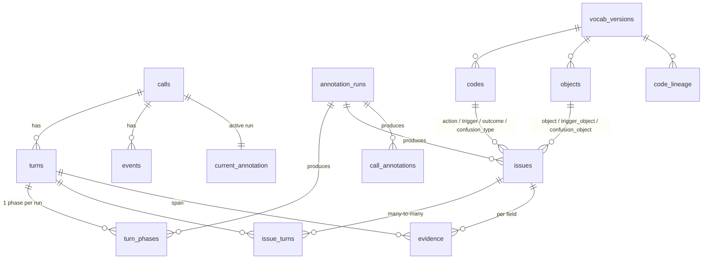

# スキーマ v0.3(確定版): 「何を保存するか」だけを決める

- 作成日: 2026-09-16
- DDL: [`poc/schema/v0_3.sql`](../../poc/schema/v0_3.sql)(DuckDB で実行確認済み。多用件・本人確認を挟む通話で導出ビューと不変条件を検証)
- 本書はスキーマのみを扱う。値をどう作るか(LLM、語彙の育て方、品質ゲート、コスト)は §7 に論点だけ列挙し、別文書で扱う。

## 0. 切り分け

| 観点 | 問い | 決めるもの | 本書 |
|---|---|---|---|
| **スキーマ** | 何を、どの単位で、どの型で保存し、何を不変条件とするか | エンティティ、キー、列、参照、制約、導出ビュー | 対象 |
| **処理** | その値をどう作り、どう更新し、どう検証するか | 抽出手順、語彙の育て方、閾値、モデル、コスト、人の関与 | 対象外 |

スキーマは処理に依存しない。同じスキーマを LLM でも人手でも規則でも埋められる(`annotation_runs.annotator` で区別する)。処理側の要請でスキーマに入るのは「出所を記録する列」と「語彙の版・状態・系譜」だけで、これは処理の中身を決めない。

## 1. 確定事項

1. **原子単位はターン、分析単位は用件(issue)、通話は導出。** 用件はターンと多対多で結びつき、非連続でよい。
2. **ソース層と注釈層を分ける(スタンドオフ)。** `calls` / `turns` / `events` は観測事実。`turn_phases` / `issues` / `issue_turns` / `evidence` / `call_annotations` は注釈で、すべて `run_id` を持つ。通話ごとに有効な注釈 run は `current_annotation` が 1 つ指す。
3. **分析列はすべて閉じた語彙。** `codes`(コード表)または `objects`(対象マスタ)への参照。自由記述は `summary_ja` と `other_text` のみで、集計に使わない。
4. **用件は「行為 × 対象」で表す。** `action_code`(照会する / 変更を依頼する / 申し込む / 解約する / 不具合を報告する / 苦情を言う / 確認する / その他)× `object_code`(商品・書面・画面・手続き・契約属性・用語・キャンペーンを 1 表で持つ対象マスタ)。旧 `reason_l1/l2` は廃止し、必要なら `action × object.parent` から導出する。
5. **「何について」はすべて対象マスタを参照する。** 用件の対象、きっかけの対象(`trigger_object_code`: どの書面を受け取ったか)、混乱の対象(`confusion_object_code`: 何がわかりづらかったか)を同じ `objects` で表す。旧 `touchpoint_code` は廃止。
6. **局面は 6 値の閉じた語彙。** `opening / purpose_statement / verification / discussion / closing / off_topic`。ターンごとにちょうど 1 つ。保留・転送は局面ではなく `events`。
7. **根拠は位置参照+引用。** `evidence(turn_idx, begin_char, end_char, quote, verified)`。判断列(`action / trigger / outcome / confusion / repeat_contact`)ごとに持つ。
8. **感情は通話レベル。** `call_annotations.emotion_start / emotion_end`。用件ごとの感情は信頼性が低いため持たない。
9. **語彙は版・状態・系譜を持つ。** `vocab_versions`、`codes.status(stable / provisional / retired)`、`code_lineage(split / merge / rename / reparent)`。任意の過去期間を任意の版で再表現できる。
10. **主用件は通話につき 1 つ。** `issues.is_primary`。`score` は任意。

## 2. ER 図



## 3. テーブル一覧(要点)

| 層 | テーブル | 主キー | 要点 |
|---|---|---|---|
| 語彙 | `vocab_versions` | vocab_version | 版 |
| 語彙 | `codes` | (code_set, code) | 全閉語彙を 1 表。階層・定義文・状態・有効版 |
| 語彙 | `objects` | object_code | 対象マスタ。`object_kind` と親、業務マスタへの外部参照 |
| 語彙 | `code_lineage` | (code_set, from, to, version) | 分割・統合・改名・親替え |
| ソース | `calls` | call_id | 通話メタデータ |
| ソース | `turns` | (call_id, turn_idx) | 発話。話者は customer / agent / system |
| ソース | `events` | (call_id, event_idx) | 保留・転送・システム操作のタイムレンジ |
| 注釈 | `annotation_runs` | run_id | 誰が・どの版で付けたか |
| 注釈 | `current_annotation` | call_id | 有効な run |
| 注釈 | `turn_phases` | (run_id, call_id, turn_idx) | 局面 |
| 注釈 | `issues` | (run_id, call_id, issue_idx) | 用件の事実(§1-4, 5) |
| 注釈 | `issue_turns` | (run_id, call_id, issue_idx, turn_idx) | 帰属 |
| 注釈 | `evidence` | (run_id, call_id, issue_idx, field, turn_idx, begin_char) | 根拠 |
| 注釈 | `call_annotations` | (run_id, call_id) | 感情、通話要約 |
| 導出 | `v_issues`, `v_calls` | — | 有効 run のみ。用件数、主用件、全解決、本人確認ターン数、未対応用件の有無 |

## 4. 不変条件(DDL 内に検査ビューとして定義)

| ID | 条件 | 検査ビュー |
|---|---|---|
| I1 | 有効 run では全ターンにちょうど 1 つの局面 | `chk_phase_coverage` |
| I2 | 用件が 1 つ以上ある通話では主用件がちょうど 1 つ | `chk_primary_issue` |
| I3 | `verification` 局面のターンは用件に帰属しない | `chk_verification_not_in_issue` |
| I4 | 根拠の引用は本文の該当範囲と逐語一致 | `chk_evidence_unverified` |
| I5 | 用件のコード列は退役していないコードを参照 | `chk_code_validity` |

参照整合(存在しないターン・用件・コード・対象を指さない)は外部キーで強制する。

## 5. 目的の数値が出ることの確認

```sql
-- (a) テーマ(行為 × 対象の親)の週次件数。分母は用件数と通話数の両方を出す
SELECT strftime(started_at, '%Y-W%V') AS week,
       COUNT(*) FILTER (WHERE action_code = 'inquire' AND parent_object = 'BILLING') AS theme_issues,
       COUNT(*) AS issues,
       COUNT(DISTINCT call_id) AS calls
FROM v_issues GROUP BY week ORDER BY week;

-- (a) 急増期間 vs 平常期間の、きっかけ × 混乱対象の分布(テーマ該当の用件のみ)
SELECT period, trigger_code, trigger_object_code, confusion_type, confusion_object_code, COUNT(*) AS n
FROM v_issues_with_period WHERE action_code = 'inquire' AND parent_object = 'BILLING'
GROUP BY ALL ORDER BY period, n DESC;

-- (b) わかりづらい対象 × 訴え方 × 下流コスト(用件数ベース)
SELECT confusion_object_code, confusion_type, COUNT(*) AS n,
       AVG(CASE WHEN outcome_code IN ('unresolved','escalated') THEN 1.0 ELSE 0 END) AS not_resolved
FROM v_issues WHERE confusion_type <> 'none'
GROUP BY ALL ORDER BY n DESC;

-- 通話単位では見えなかったもの: 述べられたが議論されなかった用件
SELECT call_id, issue_idx, action_code, object_code FROM v_issues WHERE n_discussion_turns = 0;
```

すべて GROUP BY で完結し、自由記述列は登場しない。

## 6. スキーマとして残る判断(処理ではなく形の問題)

| 論点 | 現状の決定 | 変える場合の条件 |
|---|---|---|
| 用件を「行為 × 対象」にしたことで、対象マスタが大きく異種になる | `object_kind` と親で階層化して吸収 | 対象が数千を超え運用に耐えなければ、`object_kind` ごとに表を分ける |
| 1 ターンに複数用件を許すか | 許す(`issue_turns` は多対多) | — |
| 用件ごとの感情 | 持たない | 用件レベルの感情が要件になれば `issues` に列追加(信頼性は低い前提) |
| チャネル差(チャット・メール) | `turns` で吸収。`channel` は `calls` の属性 | メールのようにターン概念が弱い場合は 1 メッセージ = 1 ターン |
| 顧客単位の分析 | 対象外。`calls.customer_id` で結合可能にしてある | ジャーニー分析が要件になれば `customers` と導出ビューを追加 |
| オペレータ行動(QA) | 対象外。`turn_phases` と `events` があるため時間窓クエリで一部代替 | 要件化されれば `turn_behaviors(run_id, call_id, turn_idx, behavior_code)` を追加。既存表は変えない |

## 7. 処理側へ送った論点(本書では扱わない)

- 局面と用件帰属を LLM にどう出させるか(一段か二段か、入力の絞り方、本人確認ターンの除外)
- 語彙・対象マスタの初期作成と更新(KSTC 型の誘導、暫定コードの即時作成、夜間統合、選好ペアによる拒否権、閾値)
- 品質ゲート(逐語一致、2 モデル間一致、分割半分再現、合成データ回帰、CRM 整合、既知事例の盲検再現、目視 30 件)
- 分析レシピの手順(分母、比較期間、両側引用、未説明残余)
- コストとモデル選択

これらはスキーマの列を増やさない。処理の変更は `annotation_runs` の新しい run として現れ、スキーマは変わらない。
